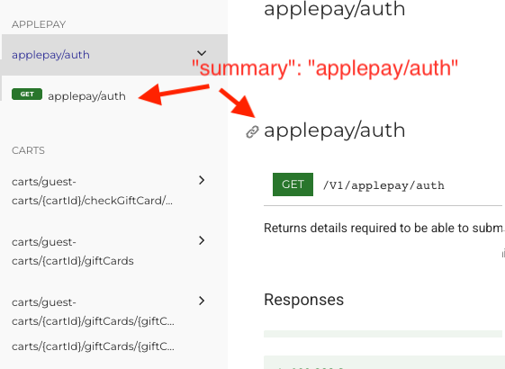
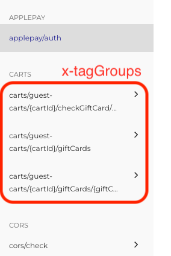
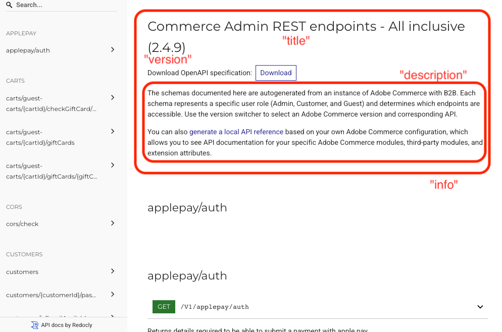

# Adobe Commerce REST schema transformer

A toolkit that gets, cleans up, updates, and converts a Commerce REST schema for Redoc.

## Prerequisites

1. [Ruby](https://www.ruby-lang.org/en/documentation/installation/)
1. [Node.js](https://nodejs.org/en)
1. [Yarn](https://www.npmjs.com/package/yarn)
1. [jq](https://stedolan.github.io/jq/download/)

## Install dependencies

```sh
yarn install
```

## Configure variables

Create a `.env` file:

```sh
cp .env.example .env
```

Set values for your running Commerce app in `.env`.

## Get, transform, and process the schema

You can get all three original schemas and transform them in one run.
Just make sure the Magento app is running.

```bash
bin/get-schemas-for-redoc
```

> NOTE: Be ready to enter a 2FA code and a version of the running Adobe Commerce.

Find the redoc-ready schemas in the `__output__` folder. For debugging, use the intermediate files in `__output__/artifacts`.

### Only process the schema

If you already have the following schemas locally:

- `__output__/artifacts/admin-schema-original.json`
- `__output__/artifacts/customer-schema-original.json`
- `__output__/artifacts/guest-schema-original.json`

then you can process them with:

```bash
bin/process-schemas-for-redoc
```

## Schema transformations

The transformer applies several optimizations to make the OpenAPI schemas more suitable for Redoc documentation:

### Optimization for Redoc

- **Sorting**: All API paths are sorted alphabetically for consistent ordering.
  See [PathSorter.test.js](src/__tests__/PathSorter.test.js).
- **Endpoint name**: Adds a `summary` key to each endpoint.
  It is generated from the endpoint path and is used as a title for the endpoint in the HTML.

  

  See [SummaryGenerator.test.js](src/__tests__/SummaryGenerator.test.js).
- **Tag generation**: Updates `tag` key of an endpoint according to the endpoint path.
  It doesn't show up explicitly in the HTML, but `tag` is used as a reference for linking of the endpoint's content block in the HTML.
  See [TagsUpdater.test.js](src/__tests__/TagsUpdater.test.js).
- **Tag grouping**: Creates logical groups based on the second path segment
  (e.g., all `/V1/customers/*` endpoints are grouped under "customers")
  via Redoc-specific extensions `x-tagGroups` for improved navigation in Redoc.

  

  See [TagGroupsGenerator.test.js](src/__tests__/TagGroupsGenerator.test.js).
- **Tags list update**: Updates the `tags` object by keeping only `"name"` keys and replacing values with endpoint paths.
  It doesn't affect the HTML generated by Redoc.
  See [TagsGenerator.test.js](src/__tests__/TagsGenerator.test.js).

### Metadata edits

- **Version information**: Updates the schema version to match your Commerce
  installation.
- **Title standardization**: Sets consistent titles for Admin, Customer, and
  Guest API schemas.
- **Host normalization**: Sets a placeholder host (`example.com`) for
  documentation purposes.
- **Introduction**: Adds a reference to shared documentation content with introductory description in
  `_includes/redocly-intro.md`.



### Format conversion

- **JSON to YAML**: Converts the final processed schemas from JSON to YAML
  format for better readability and compatibility with documentation tools.

The transformation process ensures that the generated schemas are optimized
for documentation generation while maintaining full API compatibility.

### Examples

To check examples of the different stages of transformation, see the following files:

- [examples/paas-original-static.html](examples/paas-original-static.html) - representation of the original schema in static HTML.
- [examples/paas-transformed-static.html](examples/paas-transformed-static.html) - representation after optimization for Redoc.
- [examples/paas-edited-static.html](examples/paas-edited-static.html) - representation after metadata updates.

## Running tests

This project uses [Jest][] for tests.

Use the following to run tests:

```sh
yarn test
```

[jest]: https://jestjs.io/docs/en/getting-started
